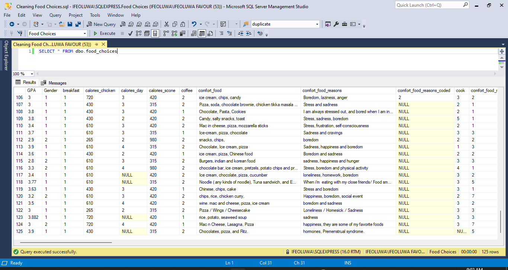
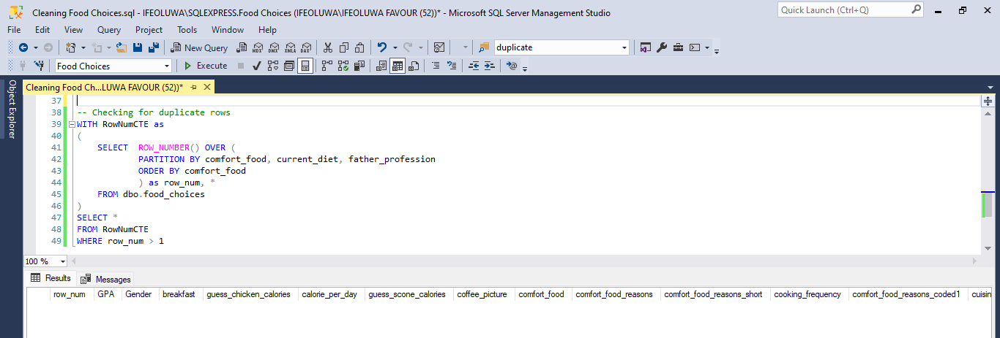
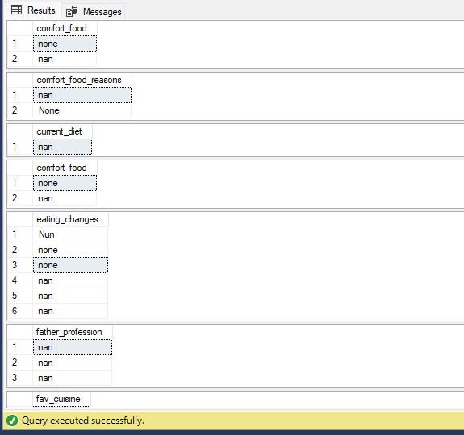
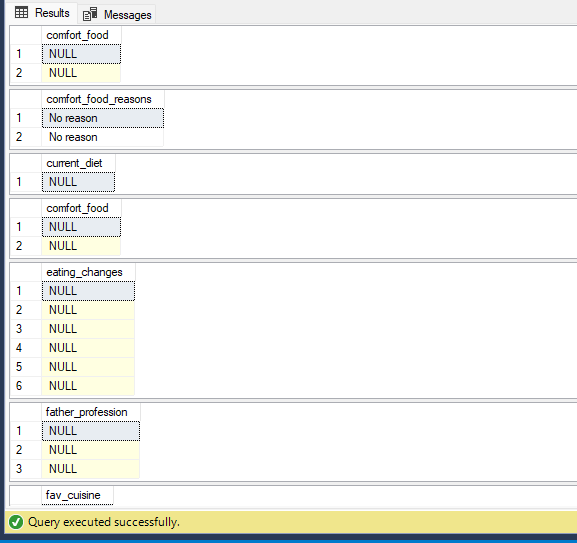

# Food Choices - Data Cleaning with SQL
**Aim of the Project**: Using SQL to clean the Food Choices data and make it ready for analysis.
<br />
<div align="center">
  <a href="https://www.geotab.com/CMS-Media-production/Blog/NA/_2020/November/data-cleaning/blog_data_cleaning_hero_@2x.jpg">
    
  </a>
</div>

<!-- TABLE OF CONTENTS -->
<details>
  <summary>Table of Contents</summary>
  <ol>
    <li><a href="#introduction">Introduction</a></li>
    <li>
      <a href="#problem-statement">Problem Statement</a>
    </li>
    <li><a href="#skills-demonstrated">Skills Demonstrated</a></li>
    <li>
      <a href="#data-wrangling">Data Wrangling</a>
      <ul>
        <li><a href="#data-collection">Data Collection</a></li>
        <li><a href="#importing-the-data">Importing the Data</a></li>
        <li><a href="#data-cleaning-and-processing">Data Cleaning and Processing</a></li>
      </ul>
    </li>
    <li><a href="#contact-me">Contact Me</a></li>
  </ol>
</details>

## Introduction
<p align="justify">
  In the world of data analysis, the process of cleaning raw data is often likened to the initial stages of sculpting a masterpiece. Without careful attention to detail and precision,     the final analysis risks being ruined by inaccuracies and inconsistencies. One of the most powerful tools for this crucial task is SQL (Structured Query Language)
<br />
<br />
    This project aims to showcase the power of SQL in cleaning and preparing real-world datasets for analysis. I'll be utilizing a dataset sourced from Kaggle, which contains survey responses from 126 college students regarding their food choices and preferences. Using SQL, we'll tackle common data cleaning tasks such as removing duplicates, handling missing values, and standardizing data formats.
</p>

## Data Collection 
* <p align="justify"><b>Surver Design:</b><br />
  Before data collection began, a comprehensive survey was designed to capture a wide range of information related to food choices. The survey questions covers various aspects such as dietary preferences, favorite foods, frequency of dining out, and factors influencing food choices. </p><br />

* <p align="justify"><b>Data Collection Method:</b><br />
  The survey was administered electronically using an online survey platform. Participants were provided with a link to the survey, which they could access and complete at their convenience. This method allowed for efficient data collection while ensuring anonymity and confidentiality for participants. Throughout the data collection process, ethical considerations were prioritized. Participants were provided with clear information about the purpose of the survey, their rights as participants, and how their data would be used. Informed consent was obtained from all participants before they began the survey. </p><br />

* <p align="justify"><b>Data Validation:</b><br />
  To maintain data integrity, measures such as incorporating validation checks within the survey platform and encouraging  participants to review their responses before submission to minimize errors, were implemented to validate the responses collected.</p>


<p align="justify">
  The dataset used in this project is a qualitative dataset and was obtained from a secondary source - <a href="https://www.kaggle.com/datasets/borapajo/food-choices?select=food_coded.csv">kaggle</a>, thanks to <a href="https://www.kaggle.com/borapajo">BoraPajo</a> for making this dataset avalaible to the public :smile:.

## Importing the Data
  <p align="justify">
    The dataset was only available in Comma-Seperated-Value (CSV) format on kaggle. To import into SQL Server Management Studio (SSMS), the dataset had to be converted into an Excel Worksheet format. To do that I <br /><i> >> opened the csv file <br /> >> used the 'save as' option <br /> >> then saved the file using the 'Excel Workbook' type. </i>

  <div align="center">
    <a href="https://www.youtube.com/watch?v=S7SpFIg5iVM">        
     </a>
  </div>

   Moving over to SSMS where the Food Choice data will be imported, a new database had to be created. To do that I <br /> <i>>> right-click on 'Databases' (under the 'Object Explorer' tab) <br /> >> Select 'New Database' <br /> >> Input the Database name (Food Choice) and click 'Okay'.</i>

  Now that the database is up and running, its time to import the data. To do that I <br /><i> >> right-click on the database (Food Choice) <br /> >> hover over 'Tasks' <br /> >> select 'Import Data' </i><br /> ...and voila we have our dataset in SSMS.
  </p>

  <div align="center">
    <a href="https://www.youtube.com/watch?v=S7SpFIg5iVM">
      
    </a>
  </div>


## Data Cleaning and Processing
* <b>Renaming Columns</b>
  <p align="justify">
    The first thing I noticed was how poorly named the columns were, making understanding the answers in the dataset challenging. To fix this, I used the docx file provided that contained all the survery questions and possoptions to choose from. 
  
  ```SQL
  -- RENAMING COLUMNS
  BEGIN TRANSACTION;
  EXEC sp_rename 'dbo.food_choices.calories_chicken', 'guess_chicken_calories', 'COLUMN';
  EXEC sp_rename 'dbo.food_choices.calories_day', 'calorie_per_day', 'COLUMN';
  EXEC sp_rename 'dbo.food_choices.calories_scone', 'guess_scone_calories', 'COLUMN';
  .
  .
  .
  EXEC sp_rename 'dbo.food_choices.weight' , 'weight_pounds' , 'COLUMN';
  COMMIT;
  ```
  ...the complete code for the query can be found [here.](SQL_Files/renaming_columns.sql) 
  </p>

---------------------------------------------------------------------
* <b>Checking for Duplicate</b>
  <p align="justify">
    To find duplicate rows, I partitioned the dataset by some of the columns with open-ended answers.
  </p>

  ```SQL
  -- Checking for duplicate rows
  WITH RowNumCTE as
  (
	SELECT	ROW_NUMBER() OVER (
			PARTITION BY comfort_food, current_diet, father_profession
			ORDER BY comfort_food
			) as row_num, *
	FROM dbo.food_choices
  )
  SELECT *
  FROM RowNumCTE
  WHERE row_num > 1
  ```
  <p align="justify">From the output below, there were no duplicates found, which further validates the intergrity of the data.
  
  
---------------------------------------------------------------------
* <b>Handling Inconsisitent Data & Nulls</b>
      <p>
      Some data quality issues I observed as regards inconsistency and nulls include:</p>
      <p>
      1. The following columns have 'none', 'nan' & 'Nun' values.<br />
      <i>`comfort_food`, `comfort_food_reasons`, `current_diet`, `eating_changes`, `father_profession`, `fav_cuisine`, `fav_childhood_food`, `healthy_meal`, `ideal_diet`, `dinner_for_friend`, `mother_profession`.
      </i>
      <br /><br />
      
      these are the rows before...
      <br /><br /><br />
      
      and these are the rows after.
      <br /><br />
      
      2. The columns <i>`comfort_food_reasons_short` & `sports`</i> have NULL values that could be corrected by cross-referencing data from other columns.
      </p>
    
    <i><b>SOLUTIONS</b></i>

    ```sql
      -- Changing the Data Type for some columns
      BEGIN TRANSACTION;

      ALTER TABLE dbo.food_choices
        ALTER COLUMN Gender nvarchar(10);
      ALTER TABLE dbo.food_choices
        ALTER COLUMN breakfast nvarchar(50);
      .
      .
      .
      ALTER TABLE dbo.food_choices
        ALTER COLUMN vitamins nvarchar(50);
    
      COMMIT;
    ```
  
    ...the complete code for the query can be found [here.](SQL_Files/fixinig_data_type.sql)

    > [!TIP]
    > Helpful advice for doing things better or more easily.
  </p>

---------------------------------------------------------------------

* <b>Data Formatting: Fixing the data type of some columns</b>
  <p align="justify">
      Most of the questions in the survey were objectives, which had 4 - 6 options varying per question. This made the entire dataset to be flooded with numbers. I'll be using the  document with the survey questions & answers to fix this. <br /><br /> But before that, the data type for these columns have to correspond with whatever will be replacing those numbers. To do that i'll be using the `ALTER TABLE` `ALTER COLUMN` statements.
    
    ```SQL
    -- Changing the Data Type for some colums
    BEGIN TRANSACTION;

    ALTER TABLE dbo.food_choices
      ALTER COLUMN Gender nvarchar(10);
    ALTER TABLE dbo.food_choices
      ALTER COLUMN breakfast nvarchar(50);
    .
    .
    .
    ALTER TABLE dbo.food_choices
      ALTER COLUMN vitamins nvarchar(50);
    
    COMMIT;
    ```
  
    ...the complete code for the query can be found [here.](SQL_Files/fixinig_data_type.sql)

    > [!TIP]
    > Helpful advice for doing things better or more easily.
  </p>
---------------------------------------------------------------------


<!-- * Data Tranformation for some columns with inconsistent data

  Removing empty cells and Missing Data. -->
