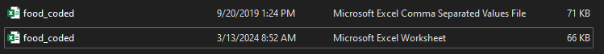

# Food Choices - Data Cleaning with SQL
**Aim of the Project**: Using SQL to clean the Food Choices data and make it ready for analysis hfwihbk.
<br />
<div align="center">
  <a href="https://www.geotab.com/CMS-Media-production/Blog/NA/_2020/November/data-cleaning/blog_data_cleaning_hero_@2x.jpg">
    
  </a>
</div>

<!-- TABLE OF CONTENTS -->
<details>
  <summary>Table of Contents</summary>
  <ol>
    <li><a href="#introduction">Introduction</a></li>
    <li>
      <a href="#problem-statement">Problem Statement</a>
    </li>
    <li><a href="#skills-demonstrated">Skills Demonstrated</a></li>
    <li>
      <a href="#data-wrangling">Data Wrangling</a>
      <ul>
        <li><a href="#data-collection">Data Collection</a></li>
        <li><a href="#importing-the-data">Importing the Data</a></li>
        <li><a href="#data-cleaning-and-processing">Data Cleaning and Processing</a></li>
      </ul>
    </li>
    <li><a href="#contact-me">Contact Me</a></li>
  </ol>
</details>

## Introduction
<p align="justify">
  In the world of data analysis, the process of cleaning raw data is often likened to the initial stages of sculpting a masterpiece. Without careful attention to detail and precision,     the final analysis risks being ruined by inaccuracies and inconsistencies. One of the most powerful tools for this crucial task is SQL (Structured Query Language)
<br />
<br />
    This project aims to showcase the power of SQL in cleaning and preparing real-world datasets for analysis. I'll be utilizing a dataset sourced from Kaggle, which contains survey responses from 126 college students regarding their food choices and preferences. Using SQL, we'll tackle common data cleaning tasks such as removing duplicates, handling missing values, and standardizing data formats.
</p>

## Data Collection
* <b>Surver Design:</b> <p align="justify">
  Before data collection began, a comprehensive survey was designed to capture a wide range of information related to food choices. The survey questions covers various aspects such as dietary preferences, favorite foods, frequency of dining out, and factors influencing food choices. </p>


* <b>Data Collection Method:</b> <p align="justify">
  The survey was administered electronically using an online survey platform. Participants were provided with a link to the survey, which they could access and complete at their convenience. This method allowed for efficient data collection while ensuring anonymity and confidentiality for participants. Throughout the data collection process, ethical considerations were prioritized. Participants were provided with clear information about the purpose of the survey, their rights as participants, and how their data would be used. Informed consent was obtained from all participants before they began the survey. </p>


* <b>Data Validation:</b> <p align="justify">
  To maintain data integrity, measures such as incorporating validation checks within the survey platform and encouraging  participants to review their responses before submission to minimize errors, were implemented to validate the responses collected.</p>
<br />

<p align="justify">
  The dataset used in this project is a qualitative dataset and was obtained from a secondary source - <a href="https://www.kaggle.com/datasets/borapajo/food-choices?select=food_coded.csv">kaggle</a>, thanks to <a href="https://www.kaggle.com/borapajo">BoraPajo</a> for making this dataset avalaible to the public :smile:.

## Importing the Data
  <p align="justify">
    The dataset was only available in Comma-Seperated-Value (CSV) format on kaggle. To import into SQL Server Management Studio (SSMS), the dataset had to be converted into an Excel Worksheet format. To do that I <br /><i> >> opened the csv file <br /> >> used the 'save as' option <br /> >> then saved the file using the 'Excel Workbook' type. </i>

  <div align="center">
    <a href="https://www.youtube.com/watch?v=S7SpFIg5iVM">        
     </a>
  </div>

   Moving over to SSMS where the Food Choice data will be imported, a new database had to be created. To do that I <br /> <i>>> right-click on 'Databases' (under the 'Object Explorer' tab) <br /> >> Select 'New Database' <br /> >> Input the Database name (Food Choice) and click 'Okay'.</i>

  Now that the database is up and running, its time to import the data. To do that I <br /><i> >> right-click on the database (Food Choice) <br /> >> hover over 'Tasks' <br /> >> select 'Import Data' </i><br /> ...and voila we have our dataset in SSMS.

  <div align="center">
    <a href="https://www.youtube.com/watch?v=S7SpFIg5iVM">
      
    </a>
  </div>
  </p>


## Data Cleaning and Processing
* Renaming Columns
  <p align="justify">
    The first thing i noticed was how poorly named the columns were, making understanding the replies in the dataset very very difficult. To fix this, I used the docx file provided that contained all the survery questions.
```sql
  ------------------  CLEANING THE DATA  ------------------
  -- Renaming Columns
  EXEC sp_rename 'dbo.food_choices.calories_chicken' , 'guess_chicken_calories' , 'COLUMN';
  EXEC sp_rename 'dbo.food_choices.calories_day' , 'calorie_per_day' , 'COLUMN';
  EXEC sp_rename 'dbo.food_choices.calories_scone' , 'guess_scone_calories' , 'COLUMN';
  EXEC sp_rename 'dbo.food_choices.coffee' , 'coffee_picture' , 'COLUMN';
  EXEC sp_rename 'dbo.food_choices.comfort_food_reasons_coded' , 'comfort_food_reasons_short' , 'COLUMN';
  EXEC sp_rename 'dbo.food_choices.cook' , 'cooking_frequency' , 'COLUMN';
  EXEC sp_rename 'dbo.food_choices.diet_current' , 'current_diet' , 'COLUMN';
  EXEC sp_rename 'dbo.food_choices.diet_current_coded' , 'current_diet_short' , 'COLUMN';
  EXEC sp_rename 'dbo.food_choices.drink' , 'drink_picture' , 'COLUMN';
  EXEC sp_rename 'dbo.food_choices.eating_changes_coded' , 'eating_changes_short' , 'COLUMN';
  EXEC sp_rename 'dbo.food_choices.employment' , 'employment_status' , 'COLUMN';
  EXEC sp_rename 'dbo.food_choices.father_education' , 'father_education_level' , 'COLUMN';
  EXEC sp_rename 'dbo.food_choices.fav_cuisine_coded' , 'fav_cuisine_grouped' , 'COLUMN';
  EXEC sp_rename 'dbo.food_choices.food_childhood' , 'fav_childhood_food' , 'COLUMN';
  EXEC sp_rename 'dbo.food_choices.fries' , 'fries_picture' , 'COLUMN';
  EXEC sp_rename 'dbo.food_choices.fruit_day' , 'fruit_per_day' , 'COLUMN';
  EXEC sp_rename 'dbo.food_choices.healthy_feeling' , 'do_you_feel_healthy' , 'COLUMN';
  EXEC sp_rename 'dbo.food_choices.ideal_diet_coded' , 'ideal_diet_short' , 'COLUMN';
  EXEC sp_rename 'dbo.food_choices.life_rewarding' , 'is_life_rewarding' , 'COLUMN';
  EXEC sp_rename 'dbo.food_choices.meals_dinner_friend' , 'dinner_for_friend' , 'COLUMN';
  EXEC sp_rename 'dbo.food_choices.mother_education' , 'mother_education_level' , 'COLUMN';
  EXEC sp_rename 'dbo.food_choices.on_off_campus' , 'residence' , 'COLUMN';
  EXEC sp_rename 'dbo.food_choices.pay_meal_out' , 'pay_for_meal_out' , 'COLUMN';
  EXEC sp_rename 'dbo.food_choices.soup' , 'soup_picture' , 'COLUMN';
  EXEC sp_rename 'dbo.food_choices.tortilla_calories' , 'guess_tortilla_calories' , 'COLUMN';
  EXEC sp_rename 'dbo.food_choices.turkey_calories' , 'guess_turkey_calories' , 'COLUMN';
  EXEC sp_rename 'dbo.food_choices.type_sports' , 'sport_type' , 'COLUMN';
  EXEC sp_rename 'dbo.food_choices.veggies_day' , 'veggies_per_day' , 'COLUMN';
  EXEC sp_rename 'dbo.food_choices.waffle_calories' , 'guess_waffle_calories' , 'COLUMN';
  EXEC sp_rename 'dbo.food_choices.weight' , 'weight_pounds' , 'COLUMN';
```

* Removing empty cells and Missing Data

